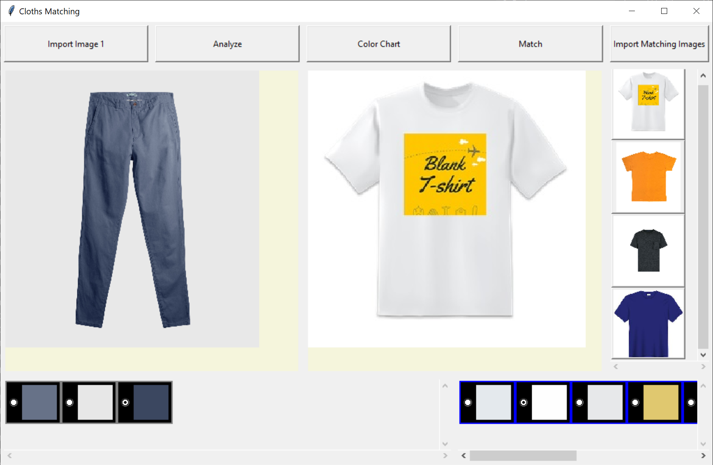

# WID2002-Clothes-Matching-System
## Screenshot


## Usage Instructions
1. Click `Import Image 1` button to import a source image
2. Click `Analyze` button to generate important colours from the image
3. Select the most important colour (the radio button)
4. Click `Import Matching Images` button to import a list of target matching images
5. Wait for few seconds
6. Click every image on the right side and select the most important colour for each image
7. Click `Match` to get the result, images on the right side will be sorted according to the best match

## Installation
- Create venv with the name venv
```Shell
py -m venv venv
```
- Activate venv
```Shell
venv\Scripts\activate
```
- Install required libraries
```Shell
py -m pip install -r requirements.txt
```
- Update requirements.txt
```Shell
pip freeze > requirements.txt
```

## Run the Program
- Run application
```Shell
py ./src/gui_main.py
```

## Contributors
| Name             | Matric Number |
| ---------------- | ------------- |
| Ng Jing Yan      | 17205274_1    |
| Ting Wei Jing    | 17205876_1    |
| Lee Cheng Hui    | 17204205_1    |
| Soh Zhi Chen     | 17204929_1    |
| Lim Jian Xhee    | 17203134_1    |
| Beh Cheng Pin    | 17202872_1    |
| Low Jun Jie      | 17207035_1    |
| Chong Zheng Shin | 17206914_1    |


## Learning
- [Colour Detection using Pandas & OpenCV](https://data-flair.training/blogs/project-in-python-colour-detection/)
- [OpenCV with Tkinter](https://www.pyimagesearch.com/2016/05/23/opencv-with-tkinter/)
- [Real Python Tkinter Tutorial](https://realpython.com/python-gui-tkinter/)
- [Tkinter Module](https://docs.python.org/3/library/tkinter.html)
- [Tkinter Tutorial](https://tkdocs.com/tutorial/index.html)
- https://anzeljg.github.io/rin2/book2/2405/docs/tkinter/index.html
- [Color Quantization using K-Means](https://scikit-learn.org/stable/auto_examples/cluster/plot_color_quantization.html)
- [Python implementation of nearest neighbor interpolation algorithm](https://www.programmersought.com/article/36124682709/)
- [Nearest Neighbor Interpolation ](https://www.imageeprocessing.com/2017/11/nearest-neighbor-interpolation.html)
