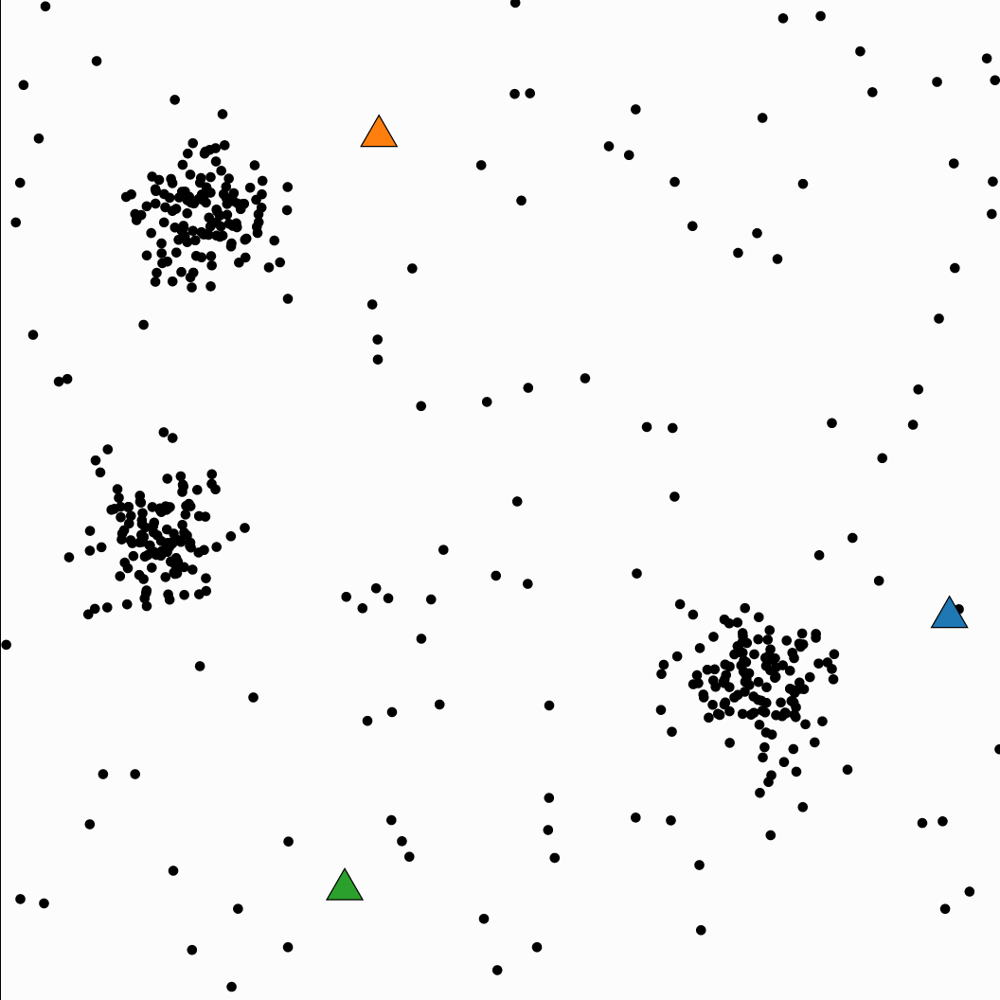
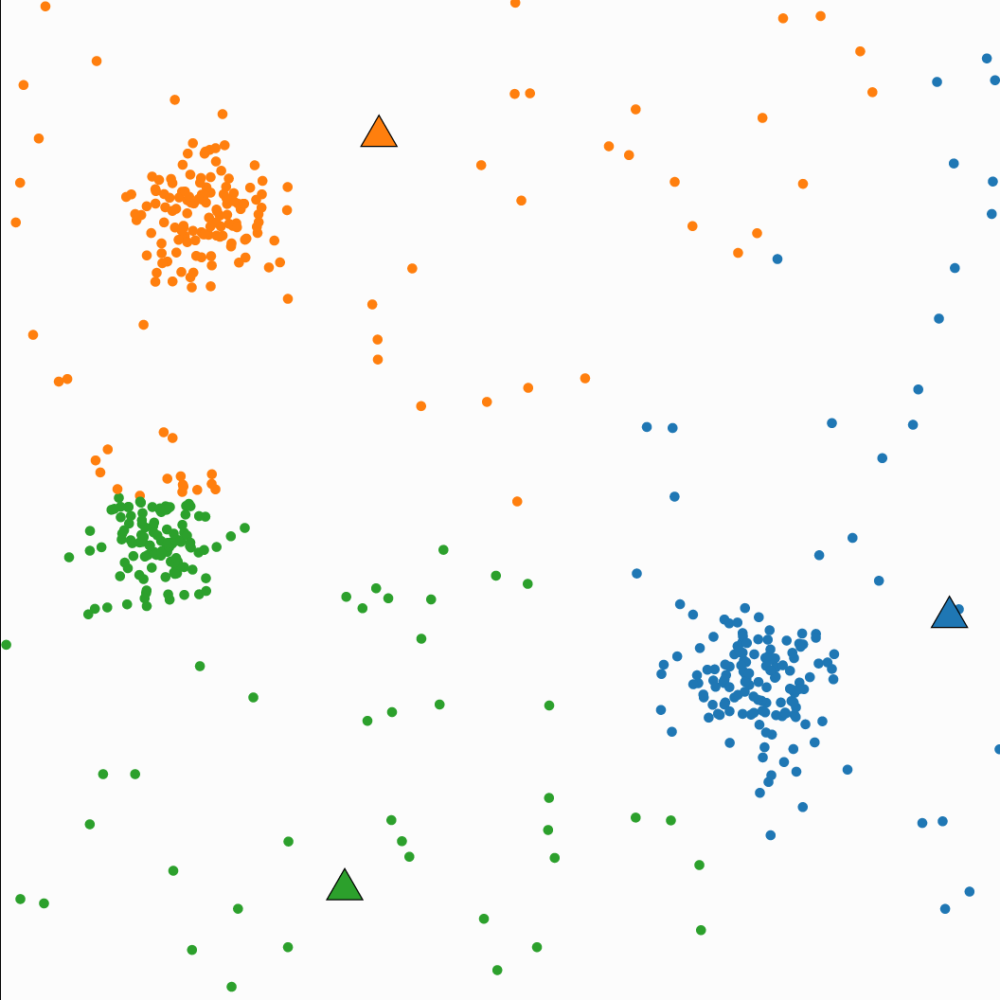
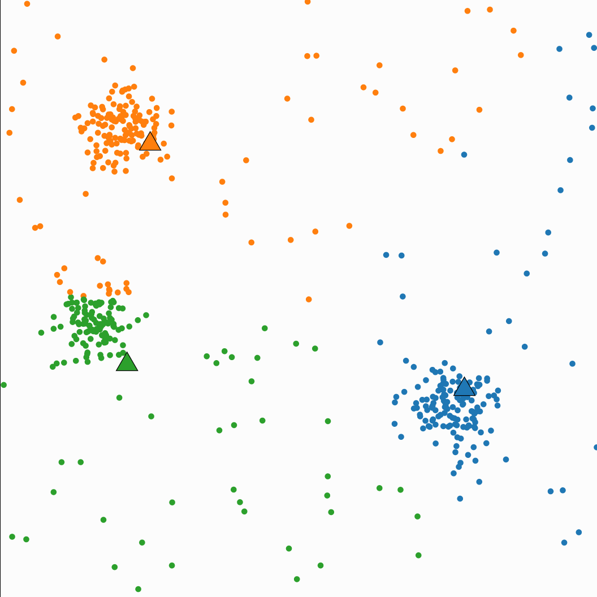

# K-means Clustering

$$
J(c^{(1)},\dots , c^{(m)}, \mu_1, \dots, \mu_K) = \frac{1}{m}\displaystyle{\sum_{i=1}^m ||x^{(i)} - \mu_{c^{(i)}}||^2}
$$

$$
c^{(i)} := \text{arg }\underset{c^{(i)}}{\text{min}} ||x^{(i)} - \mu_{c^{(i)}}||^2
$$

$$
\mu_k := \dfrac{\sum_{i=1}^m 1\{{c^{(i)}=k}\}x^{(i)}}{\sum_{i=1}^m 1\{{c^{(i)}=k}\}}
$$

Randomly initialize $K$ cluster centroids ($\mu_1, \mu_1, \dots \mu_K \in \R^n$)

Repeat until convergence {
    for $i$ = 1 to $m$ {
        $c^{(i)}$ := index (from 1 to $K$) of cluster centroid closest to $x^{(i)}$
    }
for $k$ = 1 to $K$ {
    $\mu_K$ := average (mean) of points assigned to cluster $k$
}
}

Steps
1. Randomly initialize $K$ cluster centroids

2. Assign the data points to the closest centroids (creating new clusters)

3. Calculate the means for each cluster and update the position of centroids

4. Repeat steps 2 and 3 until converge